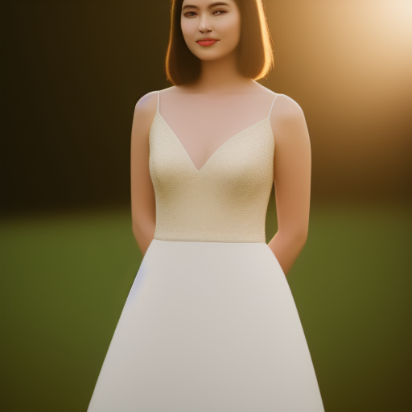
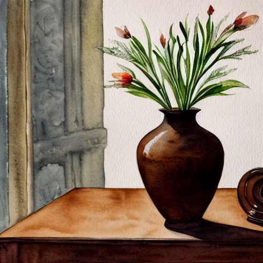

# 🎨 프롬프트 엔지니어링 워크숍 포트폴리오

> Stable Diffusion AI를 활용한 이미지 생성 실습 결과물

## 👤 수강생 정보

| 항목 | 내용 |
|------|------|
| **이름** | 허찬경 |
| **학번** | 25010526 |
| **작성일** | 2026년 01월 23일 |
| **총 작품 수** | 5개 |

---

## 📚 회차별 학습 기록

### 📖 4회차: Negative Prompting

**학습 기법**: 네거티브 프롬프팅

#### 작품 1

| 항목 | 내용 |
|------|------|
| **프롬프트** | `a beautiful portrait of a young woman, elegant dress, garden background, soft lighting` |
| **네거티브** | `bad hands, extra fingers, mutated hands, poorly drawn face, mutation, deformed, ugly` |
| **생성 시간** | 2026-01-23 06:23:59 |

> Negative Prompt는 AI가 약한 부분에 대해서 사용하면 좋을 것 같고, Guidance Scale은 문제 유형에 따라 다르게 활용할 수 있을 것 같다. 

---

### 📖 5회차: Step-back Prompting

**학습 기법**: 추상화 프롬프팅

#### 작품 1

| 항목 | 내용 |
|------|------|
| **프롬프트** | `alone` |
| **네거티브** | `blurry, low quality, distorted, text, watermark` |
| **생성 시간** | 2026-01-23 06:29:21 |

> AI는 추상적 이미지나 개념을 스스로 생각해내는 창의성이 부족하기 때문에 그 개념의 속성들을 한 ㅂ

#### 작품 2

| 항목 | 내용 |
|------|------|
| **프롬프트** | `alone` |
| **네거티브** | `blurry, low quality, distorted, text, watermark` |
| **생성 시간** | 2026-01-23 06:29:55 |

> AI는 추상적 이미지나 개념을 스스로 생각해내는 창의성이 부족하기 때문에 그 개념의 속성들을 한 번 파악하게 한 뒤 그 속성들로 추상적 개념을 표현하는 방식을 채택해야겠다는 생각이 들었다.

---

### 📖 6회차: Chain of Thought

**학습 기법**: 레이어 빌딩

#### 작품 1

| 항목 | 내용 |
|------|------|
| **프롬프트** | `a robot, reading a book, on the moon, dark ambient space, highly detailed` |
| **네거티브** | `blurry, low quality` |
| **생성 시간** | 2026-01-23 06:36:03 |

> 5번째 레이어에서 가장 많은 변화가 있었다. 이를 통해 어떤 프롬프트가 문제인지 분리해서 생각할 수 있었던 것 같다.

---

### 📖 7회차: 종합 실습

**학습 기법**: 종합

#### 작품 1

| 항목 | 내용 |
|------|------|
| **프롬프트** | `a brown vase,  highly detailed, watercolor painting, soft edges, artistic, cinematic, dramatic lighting, movie still` |
| **네거티브** | `blurry, low quality, distorted, ugly, bad anatomy` |
| **생성 시간** | 2026-01-23 06:41:44 |

> 프롬프팅 할 때 나만의 규격을 정해서 더 일정하고 통제할 수 있는 품질의 답변을 받을 수 있을 것 같다.

---

## 🏆 Best 작품

**선택한 작품**: 

**선택 이유**: 

---

## 💡 워크숍 후기

---

## 🛠️ 사용 기술

- Stable Diffusion
- Streamlit
- Google Colab + ngrok

---

<i>🎓 KNU 프롬프트 엔지니어링 워크숍 수료</i>

